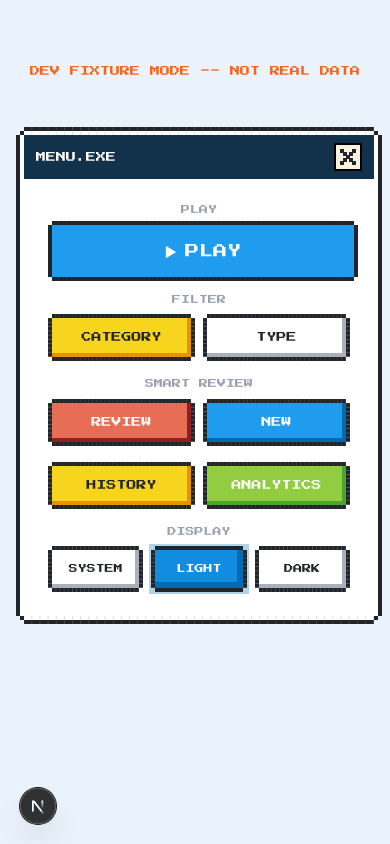
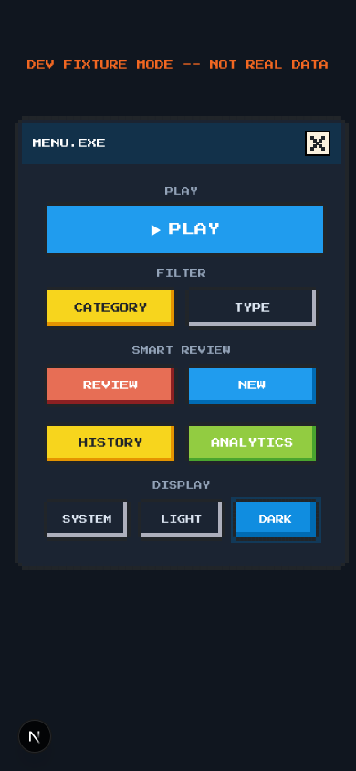
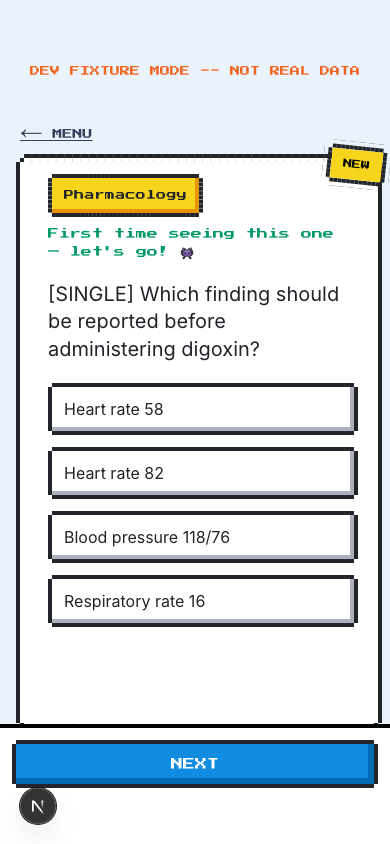
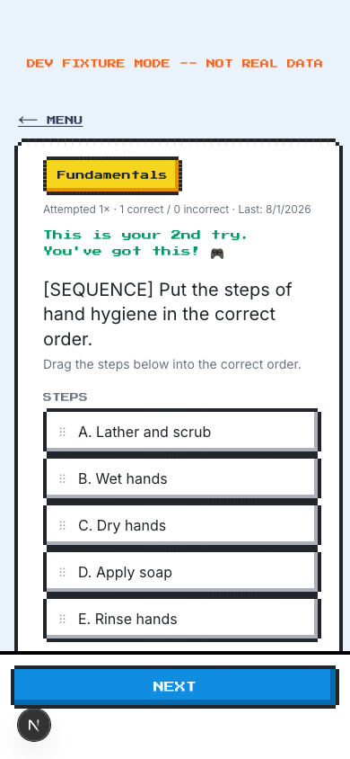
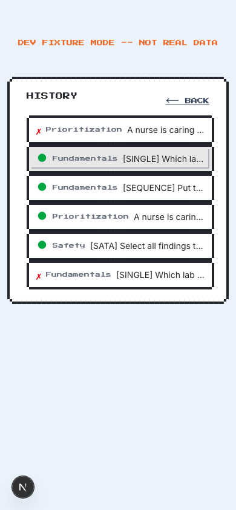
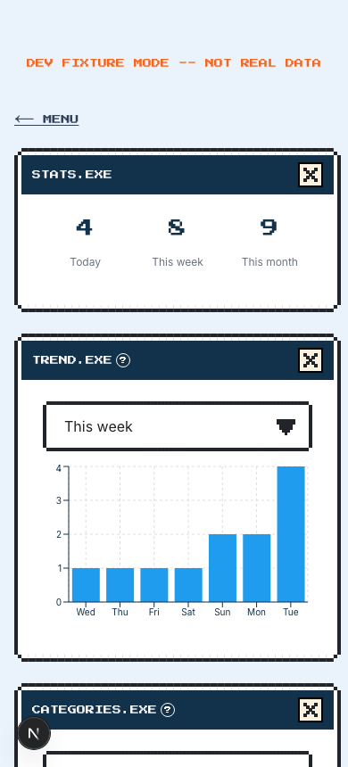

# NCLEX-RN Flashcards

A pixel-art ([nes.css](https://nostalgic-css.github.io/NES.css/)) flashcard app for NCLEX-RN study prep, built with Next.js 15 (App Router), React 19, Tailwind CSS v4, and Supabase. Deployed as a static export to GitHub Pages: **https://devseank.github.io/nclex-flashcards/**

<table>
  <tr>
    <td></td>
    <td></td>
    <td></td>
  </tr>
  <tr>
    <td></td>
    <td></td>
    <td></td>
  </tr>
</table>

## Features

- **Study modes** — PLAY (spaced-repetition practice, see [Spaced repetition](#spaced-repetition) below), REVIEW (most-missed questions — today / this week / all time / least-recently-tried), and NEW (questions you haven't attempted yet — today / this week / all time).
- **FILTER** — narrow any PLAY/REVIEW session by category, question type, and/or tags in one combined query, with a live-search box for tags and a live count of matching questions before you commit.
- **Category + freeform tags** — every question has exactly one category plus any number of freeform tags not scoped to that category (e.g. a Pharmacology question and a Prioritization question can share a "Cardiovascular" tag).
- **Three question types** — single choice, select-all-that-apply (SATA), and drag-and-drop step-ordering (sequence), all sharing one answer-comparison UI so right/wrong reads the same way regardless of type.
- **Per-question memory** — every question shows your attempt count, correct/incorrect split, and last-attempted date; brand-new questions get a golden, shine-swept "NEW" badge and a first-time cheer message instead of the usual encouragement.
- **Brief answer feedback** — a randomized confetti burst on correct answers, a shake + color flash on wrong ones, both short enough to never slow down the next question.
- **HISTORY** — browse your last 5/20/100 answered questions and reopen any one of them to see exactly what you answered and why it was right or wrong.
- **ANALYTICS** — attempts-over-time trend chart and per-category accuracy, sorted worst-to-best so you know what to review next.
- **Dark mode** — SYSTEM / LIGHT / DARK, defaults to the OS preference, and syncs to your account (via a `user_settings` table) so it follows you across devices once you're signed in.
- Signed in via Google OAuth (Supabase Auth); every question/attempt is scoped to your own account via Postgres row-level security.

## Spaced repetition

PLAY doesn't pick questions purely at random — it uses a Leitner-style box
system derived entirely from your attempt history (no separate schedule
table to keep in sync): a correct answer bumps a question up a box, meaning
a longer wait before it's due again; an incorrect answer drops it straight
back to box 0, due immediately. Box intervals: immediate / 1 day / 3 days /
7 days / 14 days / 30 days.

Rather than strict priority tiers (which turned out to have real starvation
bugs — see `src/lib/srs.ts`'s comments for the two that were caught and
rejected), the next question is chosen by **weighted-random across the
whole pool** every time: never-attempted, due, and not-yet-due questions all
compete, just with different weights, so nothing is ever *impossible* to
see next, only rarer. On top of that, a hard **escape valve** force-picks
anything that's been overdue long enough, guaranteeing a worst-case bound on
how long a question can go unseen — independent of how large the question
bank grows. See [`src/lib/srs.ts`](src/lib/srs.ts) for the exact
weights/thresholds and [`src/lib/srs.test.ts`](src/lib/srs.test.ts) for the
test suite covering that guarantee (`pnpm test`).

## Tech stack

- **Next.js 16** (App Router, static export via `output: "export"`) + **React 19**
- **Tailwind CSS v4** for layout/utility styling, **[nes.css](https://nostalgic-css.github.io/NES.css/)** for the pixel-art component look
- **Supabase** (Postgres + Auth) — see [`supabase/schema.sql`](supabase/schema.sql) for the full schema
- **[@dnd-kit](https://dndkit.com/)** for the sequence question's drag-and-drop
- **Recharts** for the analytics charts
- **Vitest** for unit tests on pure-logic modules (`src/lib/*.test.ts`) — see [Development notes](#development-notes)
- Deployed to **GitHub Pages** via GitHub Actions ([`.github/workflows/deploy.yml`](.github/workflows/deploy.yml))

## Getting started

```bash
pnpm install
cp .env.local.example .env.local   # fill in your Supabase project's URL + publishable key
pnpm dev
```

Open [http://localhost:3000](http://localhost:3000) and sign in with Google. You'll need:

1. A Supabase project, with the schema in [`supabase/schema.sql`](supabase/schema.sql) applied (paste it into the Supabase SQL Editor — it's idempotent, safe to re-run).
2. Google OAuth configured as a Supabase Auth provider (Authentication → Providers → Google), with your local/deployed URL added to the redirect allow-list.
3. Question data — see [Adding questions](#adding-questions) below. The app has nothing to show with an empty `questions` table.

### Previewing without signing in

`/dev-preview` runs the app against a small set of in-memory fixture questions/attempts instead of Supabase — useful for UI work when you don't want to go through Google OAuth. It's gitignored (local-only, not part of the deployed build), so a fresh clone won't have it — see [`src/dev/AI_INSTRUCTIONS.md`](src/dev/AI_INSTRUCTIONS.md) for what it is and how to recreate it.

## Adding questions

The question bank itself (`data/questions.csv`) is gitignored — it's private study content, not part of this repo. See [`data/AI_INSTRUCTIONS.md`](data/AI_INSTRUCTIONS.md) for the full workflow (including `scripts/parse-quiz-text.mjs`, which converts copy-pasted quiz text into the CSV format) and [`data/questions.template.csv`](data/questions.template.csv) for the column format itself.

## Project structure

```
src/
  app/            Next.js App Router entrypoint (layout, page, globals.css)
  components/     UI components (one file per screen/widget)
  hooks/          useQuizSession -- owns all quiz state/view transitions
  lib/            Small framework-agnostic helpers (quiz logic, spaced-repetition
                  scheduling, category/tag/type filtering, theme, date ranges, ...) --
                  see srs.ts + srs.test.ts for the PLAY scheduling algorithm
  services/       Supabase reads/writes (questions, attempts, settings)
  dev/            Dev-only fixture harness for /dev-preview -- not in the production build
supabase/
  schema.sql      Full Postgres schema (tables, RLS policies) -- apply by hand in Supabase
data/
  questions.template.csv   Column format reference for the (gitignored) real question bank
  AI_INSTRUCTIONS.md       Workflow for adding new questions
scripts/
  parse-quiz-text.mjs      Converts pasted quiz text into the CSV format
  csv-to-sql.mjs           Converts the CSV question bank into idempotent SQL inserts
```

## Deployment

Pushing to `main` triggers [`.github/workflows/deploy.yml`](.github/workflows/deploy.yml), which builds a static export (`GITHUB_PAGES=true`, so `next.config.ts` applies the `/nclex-flashcards` basePath) and publishes it to GitHub Pages. There's no staging environment — `main` is what's live.

## Development notes

- `pnpm lint`, `pnpm test`, and `pnpm build` should all be clean before pushing. `pnpm test` runs the Vitest suite, currently covering the spaced-repetition scheduling logic in `src/lib/srs.test.ts` — extend it when you touch quiz/scheduling logic that can be tested without a browser. There's still no automated coverage for UI/component behavior, so manual verification via `/dev-preview` or a real signed-in session remains the safety net for those.
- See [`AGENTS.md`](AGENTS.md) for architecture notes and conventions aimed at AI coding agents working in this repo.
